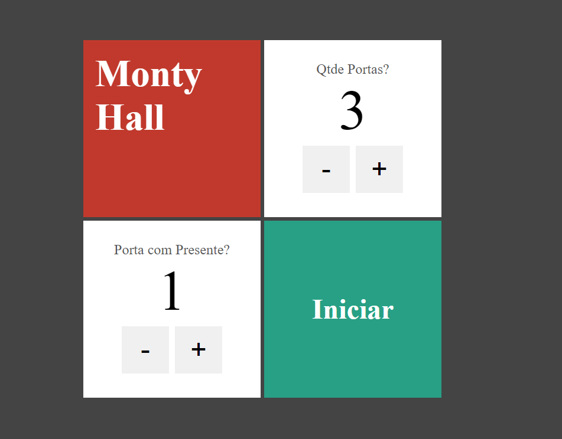
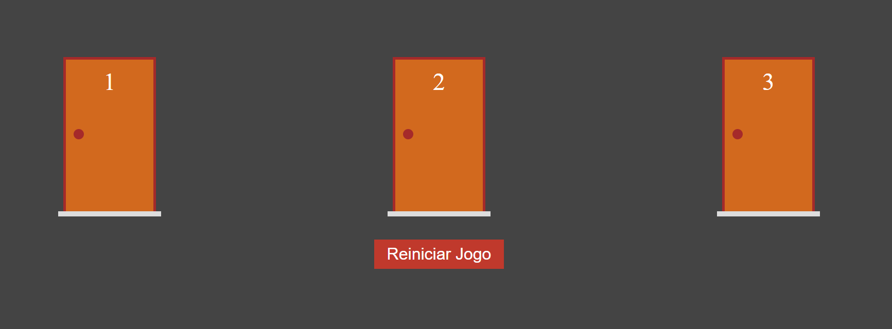
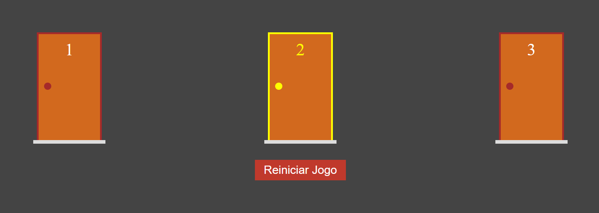
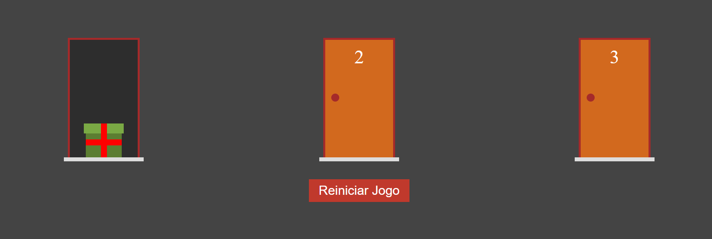

# Porta Premiada


<p align="center">
    
</p>


> Projeto realizado para colocar em prática os meus conhecimentos em Next.js, simulando o problema de Monty Hall.

## 💻 Pré-requisitos

Antes de começar, verifique se você atendeu aos seguintes requisitos:

- Você instalou a versão mais recente de `< Node >`

## 🚀 Instalando Porta Premiada

Para rodar o Porta Premiada é necessário instalar dependências de bibliotecas, siga então as seguintes etapas:

```
npm i
npm run dev
```

## ☕ Usando Porta Premiada

Para usar o Porta Premiada, siga estas etapas:

- Apresentador deve escolher quantas portas que serão colocadas para o usuário selecionar e qual a porta que contém o presente.


- O participante agora deve advinhar em qual das portas o presente está.


- Para selecionar clique na porta.


- Para abrir a porta clique na maçaneta.
